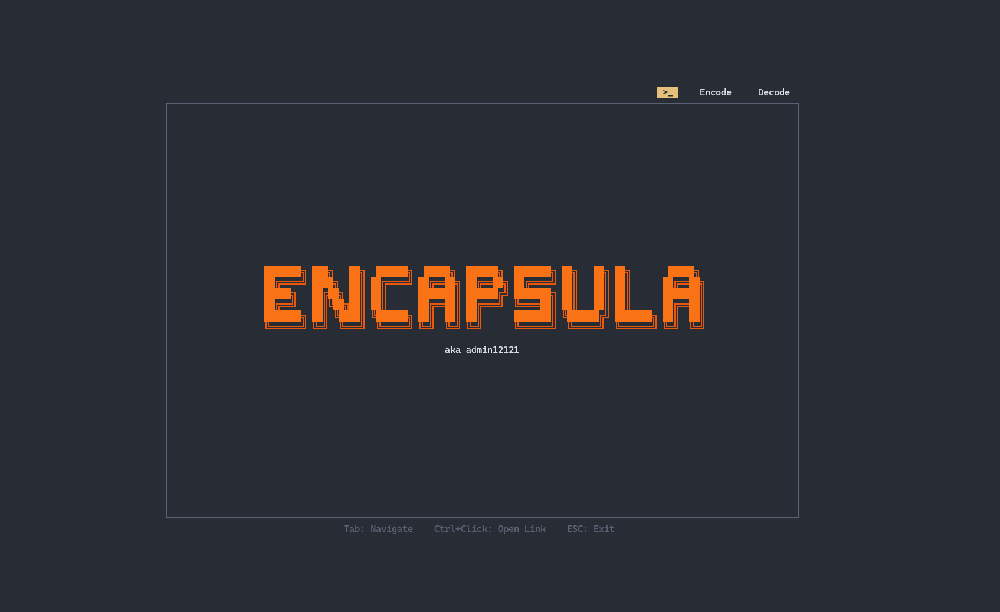

<div align="center">

# 🔐 Encapsula

### Terminal-Based Steganography & Encryption Tool

[](https://www.npmjs.com/package/encapsula)
[](LICENSE)
[](https://www.typescriptlang.org/)
[](https://nodejs.org/)
[](#encryption-details)

**Hide encrypted messages inside any file — invisibly.**

[Features](#-features) • [Installation](#-installation) • [How It Works](#-how-it-works) • [Security](#-security-analysis) • [Roadmap](#-future-roadmap)

</div>

---

## 📋 Table of Contents

- [Overview](#-overview)
- [Features](#-features)
- [Installation](#-installation)
- [Quick Start](#-quick-start)
- [How It Works](#-how-it-works)
  - [Encoding Process](#encoding-process-flowchart)
  - [Decoding Process](#decoding-process-flowchart)
  - [Encryption Details](#encryption-details)
  - [Bit-Level Operations](#bit-level-operations)
- [Security Analysis](#-security-analysis)
  - [What Makes It Secure](#what-makes-it-secure)
  - [Current Limitations](#current-limitations)
- [Demo](#-demo)
- [Future Roadmap](#-future-roadmap)
- [Contributing](#-contributing)
- [License](#-license)

---

## 🎯 Overview

**Encapsula** is a terminal-based steganography tool that combines **AES-256 encryption** with **file embedding** to hide secret messages inside ordinary files. Unlike traditional encryption that produces obvious encrypted files, Encapsula embeds your encrypted data within existing files (images, documents, executables, etc.), making the presence of hidden data nearly undetectable.

### Why Encapsula?

- 🔒 **Military-Grade Encryption**: AES-256-CBC with PBKDF2 key derivation
- 👁️ **Invisible Storage**: Messages hidden within normal files
- 🚫 **Zero Password Storage**: Passwords never saved to disk
- 💻 **Terminal UI**: Beautiful, interactive command-line interface
- 🎯 **Simple Workflow**: Upload → Message → Password → Done

---

## ✨ Features

| Feature | Description |
|---------|-------------|
| **AES-256-CBC Encryption** | Industry-standard symmetric encryption algorithm |
| **PBKDF2 Key Derivation** | 100,000 iterations with SHA-512 for key strengthening |
| **Steganographic Embedding** | Hides encrypted data within host files |
| **Multi-line Messages** | Support for complex, formatted secret messages |
| **Interactive TUI** | Terminal-based user interface with progress tracking |
| **Cross-Platform** | Works on Windows, macOS, and Linux |
| **No Password Storage** | Passwords cleared from memory after use |
| **Auto-Download** | Encoded files automatically copied to Downloads |

---

## 📦 Installation

### NPX (Recommended - No Installation)

```bash
npx encapsula
```

### Global Installation

```bash
npm install -g encapsula
encapsula
```

### From Source

```bash
git clone https://github.com/admin12121/Encapsula.git
cd Encapsula
npm install
npm run build
npm start
```

### Requirements

- Node.js 20 or higher
- Terminal with ANSI color support
- Windows: PowerShell (for file dialogs)

---

## 🚀 Quick Start

### Encoding (Hiding a Message)

1. **Launch Encapsula**
   ```bash
   npx encapsula
   ```

2. **Navigate to Encode Tab** (Press `Tab` key)

3. **Upload Host File** (Press `Enter`)
   - Select any file (image, PDF, video, etc.)

4. **Enter Secret Message**
   - Type your multi-line message
   - Press `Ctrl+S` when finished

5. **Set Password**
   - Enter a strong password
   - Press `Enter`

6. **Done!**
   - Encoded file saved to Downloads folder

### Decoding (Retrieving a Message)

1. **Navigate to Decode Tab**

2. **Upload Encoded File**

3. **Enter Password** (same as encoding)

4. **View Decrypted Message**

---

## 🔍 How It Works

Encapsula uses a two-layer approach: **encryption** for confidentiality and **steganography** for concealment.

### Encoding Process Flowchart

```
┌─────────────────────────────────────────────────────────────────┐
│                        ENCODING WORKFLOW                         │
└─────────────────────────────────────────────────────────────────┘

    ┌──────────────┐
    │  User Input  │
    │  (Message +  │
    │  Password)   │
    └──────┬───────┘
           │
           ▼
    ┌──────────────────────────────────────────┐
    │  1. Key Derivation (PBKDF2)              │
    │     • Password → SHA-256 Hash → Salt     │
    │     • 100,000 iterations                 │
    │     • Output: 32-byte AES key            │
    └──────┬───────────────────────────────────┘
           │
           ▼
    ┌──────────────────────────────────────────┐
    │  2. Message Encryption (AES-256-CBC)     │
    │     • Generate random 16-byte IV         │
    │     • Encrypt message with AES-256       │
    │     • Output: [IV][Encrypted Data]       │
    └──────┬───────────────────────────────────┘
           │
           ▼
    ┌──────────────────────────────────────────┐
    │  3. Payload Construction                 │
    │     • Combine: IV + Encrypted Message    │
    │     • Calculate payload length           │
    └──────┬───────────────────────────────────┘
           │
           ▼
    ┌──────────────────────────────────────────┐
    │  4. File Embedding                       │
    │     • Read original host file            │
    │     • Append marker: "<<ENCAPSULA_>>     │
    │     • Append length (4 bytes, Big Endian)│
    │     • Append encrypted payload           │
    │     • Append end marker                  │
    └──────┬───────────────────────────────────┘
           │
           ▼
    ┌──────────────┐
    │  Output File │
    │  [Original]  │
    │  [Hidden]    │
    └──────────────┘
```

### Decoding Process Flowchart

```
┌─────────────────────────────────────────────────────────────────┐
│                        DECODING WORKFLOW                         │
└─────────────────────────────────────────────────────────────────┘

    ┌──────────────┐
    │ Encoded File │
    └──────┬───────┘
           │
           ▼
    ┌──────────────────────────────────────────┐
    │  1. Marker Detection                     │
    │     • Search for "<<ENCAPSULA_HIDDEN>>"  │
    │     • Verify marker exists               │
    └──────┬───────────────────────────────────┘
           │
           ▼
    ┌──────────────────────────────────────────┐
    │  2. Payload Extraction                   │
    │     • Read 4-byte length header          │
    │     • Extract encrypted payload          │
    │     • Validate payload size (< 10MB)     │
    └──────┬───────────────────────────────────┘
           │
           ▼
    ┌──────────────────────────────────────────┐
    │  3. Key Derivation (PBKDF2)              │
    │     • User password → SHA-256            │
    │     • Same 100,000 iterations            │
    │     • Must match encoding key            │
    └──────┬───────────────────────────────────┘
           │
           ▼
    ┌──────────────────────────────────────────┐
    │  4. Decryption (AES-256-CBC)             │
    │     • Extract IV (first 16 bytes)        │
    │     • Decrypt remaining payload          │
    │     • Verify padding (PKCS7)             │
    └──────┬───────────────────────────────────┘
           │
           ▼
    ┌──────────────┐
    │   Original   │
    │   Message    │
    └──────────────┘
```

### Encryption Details

#### 🔑 Key Derivation (PBKDF2)

Encapsula doesn't use your password directly. Instead, it derives a cryptographic key:

```
Password (User Input)
    ↓
SHA-256 Hash → "encapsula-salt"
    ↓
PBKDF2 (100,000 iterations, SHA-512)
    ↓
32-byte AES-256 Key
```

**Why PBKDF2?**
- **Slow by Design**: 100,000 iterations make brute-force attacks computationally expensive
- **Key Stretching**: Converts weak passwords into strong cryptographic keys
- **Deterministic**: Same password always produces same key

#### 🔐 AES-256-CBC Encryption

```
Plaintext Message
    ↓
Generate Random IV (16 bytes)
    ↓
AES-256-CBC Cipher (with derived key)
    ↓
Encrypted Blocks (padded with PKCS7)
    ↓
Output: [IV][Ciphertext]
```

**AES-256-CBC Properties:**
- **Block Size**: 128 bits (16 bytes)
- **Key Size**: 256 bits (32 bytes)
- **Mode**: Cipher Block Chaining (CBC)
- **Padding**: PKCS7

### Bit-Level Operations

#### How Data is Embedded

The embedding process appends encrypted data to the end of the host file:

```
┌──────────────────────────────────────────────────────────────┐
│                    ORIGINAL HOST FILE                         │
│  [File Header][File Data][File Metadata][EOF]                │
└──────────────────────────────────────────────────────────────┘
                                                    ↓
┌──────────────────────────────────────────────────────────────┐
│                   ENCODED HOST FILE                           │
│  [File Header][File Data][File Metadata][EOF]                │
│  [MARKER][LENGTH][IV][ENCRYPTED_DATA][MARKER]                │
└──────────────────────────────────────────────────────────────┘
```

**Byte Structure:**

```
Offset  | Size    | Description
--------|---------|------------------------------------------
0       | N bytes | Original file content (unchanged)
N       | 20 bytes| Start marker: "<<ENCAPSULA_HIDDEN>>"
N+20    | 4 bytes | Payload length (UInt32, Big Endian)
N+24    | 16 bytes| Initialization Vector (IV)
N+40    | M bytes | AES-256-CBC encrypted message
N+40+M  | 20 bytes| End marker: "<<ENCAPSULA_HIDDEN>>"
```

#### Why This Works

1. **Most file formats ignore trailing data** — extra bytes beyond EOF are ignored by viewers
2. **Original file remains functional** — images still display, PDFs still open
3. **No visual artifacts** — the file looks and behaves exactly as before
4. **Marker-based extraction** — reliable payload detection during decoding

### Memory and Security Flow

```
┌─────────────────────────────────────────────────────────────┐
│                    MEMORY LIFECYCLE                          │
└─────────────────────────────────────────────────────────────┘

Encoding:
  User Input → Temp Buffer → Encryption → Clear Buffer
                    ↑                           ↓
                    └───── Password Cleared ────┘
                          (After processing)

Decoding:
  User Input → Temp Buffer → Decryption → Display → Clear
                    ↑                                  ↓
                    └──────── Password Cleared ───────┘
```

**Password Never Persisted:**
- ✅ Held only in runtime memory
- ✅ Cleared after encryption/decryption
- ✅ Never written to disk
- ✅ Not included in any logs

---

## 🛡️ Security Analysis

### What Makes It Secure

| Security Feature | Implementation | Benefit |
|-----------------|----------------|---------|
| **AES-256 Encryption** | Industry-standard symmetric cipher | Computationally infeasible to break |
| **Random IVs** | Crypto.randomBytes(16) per message | Prevents pattern analysis |
| **Key Derivation** | PBKDF2 with 100k iterations | Resists brute-force attacks |
| **No Password Storage** | Cleared from memory post-use | No plaintext password leakage |
| **Steganographic Concealment** | Hidden within normal files | Reduces detection risk |
| **Multi-Layer Defense** | Encryption + Steganography | Defense in depth |

### Current Limitations

⚠️ **Known Security Concerns** (Planned for v2.0)

#### 1. **Fixed Salt Vulnerability**
```typescript
// Current implementation (src/sections/encode.ts)
const salt = crypto.createHash("sha256").update("encapsula-salt").digest();
```

**Issue**: Hardcoded salt is the same for all users  
**Risk**: Enables rainbow table attacks if password is weak  
**Severity**: Medium  
**Planned Fix**: Generate random salt per file, store alongside IV

#### 2. **No Data Integrity Verification**
```typescript
// Missing HMAC verification
const payload = Buffer.concat([iv, encrypted]);
```

**Issue**: No cryptographic signature to verify data integrity  
**Risk**: Tampering undetectable until decryption fails  
**Severity**: Medium  
**Planned Fix**: Add HMAC-SHA256 authentication tag

#### 3. **Marker Collision Risk**
```typescript
const marker = Buffer.from("<<ENCAPSULA_HIDDEN>>", "utf8");
```

**Issue**: If original file contains this exact sequence, extraction could fail  
**Risk**: Low (20-byte sequence unlikely in practice)  
**Severity**: Low  
**Planned Fix**: Use cryptographic markers or offset-based indexing

#### 4. **Limited Size Validation**
```typescript
if (dataLength <= 0 || dataLength > 10 * 1024 * 1024) return null;
```

**Issue**: Arbitrary 10MB limit may be too permissive  
**Risk**: Potential DoS via memory exhaustion  
**Severity**: Low  
**Planned Fix**: Configurable limits with streaming decryption

#### 5. **Password in Memory**
```typescript
state.password = state.inputBuffer; // Held until processing
```

**Issue**: Password string not securely wiped from memory  
**Risk**: Memory dump could reveal password  
**Severity**: Low (requires privileged access)  
**Planned Fix**: Use secure buffers with zeroing

#### 6. **No Forward Secrecy**
**Issue**: Same password always produces same key (due to fixed salt)  
**Risk**: Compromised password affects all past/future messages  
**Severity**: Medium  
**Planned Fix**: Random per-file salts + optional key rotation

#### 7. **CBC Mode Padding Oracle**
**Issue**: AES-CBC vulnerable to padding oracle attacks if errors leak info  
**Risk**: Theoretical (requires timing side-channel)  
**Severity**: Low  
**Planned Fix**: Migrate to AES-GCM (authenticated encryption)

---

## 📸 Demo



*Interactive terminal interface showing the encode/decode workflow*

---

## 🚀 Future Roadmap

### v2.0 - Security Hardening (Q2 2025)

- [ ] **Random Per-File Salts** — Eliminate rainbow table attacks
- [ ] **HMAC Authentication** — Add SHA-256 HMAC for integrity verification
- [ ] **AES-GCM Migration** — Replace CBC with authenticated encryption
- [ ] **Secure Memory Handling** — Zero-fill password buffers
- [ ] **Configurable KDF Iterations** — Allow users to adjust PBKDF2 rounds

### v3.0 - Advanced Features (Q3 2025)

- [ ] **Multiple Encryption Modes**
  - AES-256-GCM (Authenticated)
  - ChaCha20-Poly1305 (Modern alternative)
  - RSA + AES Hybrid (Public key encryption)

- [ ] **Encoding Methods**
  - LSB Steganography (bit-level embedding in images)
  - Whitespace Encoding (for text files)
  - File Format-Specific Embedding (JPEG comments, PNG metadata)

- [ ] **Advanced Security**
  - Multi-factor decryption (password + keyfile)
  - Plausible deniability (fake passwords reveal decoy messages)
  - Compression before encryption
  - Self-destructing messages (time-based deletion)

- [ ] **Enhanced Usability**
  - GUI version (Electron wrapper)
  - Batch encoding/decoding
  - Cloud storage integration
  - Mobile companion app

### v4.0 - Enterprise Features (Q4 2025)

- [ ] **Audit & Compliance**
  - Activity logging (with privacy controls)
  - Access control policies
  - Compliance reports (GDPR, HIPAA)

- [ ] **Advanced Cryptography**
  - Quantum-resistant algorithms (CRYSTALS-Kyber)
  - Threshold cryptography (split keys)
  - Zero-knowledge proofs

---

## 🤝 Contributing

Contributions are welcome! Here's how you can help:

1. **Report Bugs** — Open an issue with details
2. **Suggest Features** — Propose enhancements
3. **Submit PRs** — Fix bugs or implement features
4. **Security Audits** — Help identify vulnerabilities

### Development Setup

```bash
git clone https://github.com/admin12121/Encapsula.git
cd Encapsula
npm install
npm run dev
```

### Running Tests (Coming Soon)

```bash
npm test
```

---

## 📄 License

This project is licensed under the **MIT License** — see [LICENSE](LICENSE) file for details.

---

## ⚠️ Disclaimer

**Encapsula is provided for educational and legitimate privacy purposes only.**

- This tool is **not** intended for illegal activities
- Users are responsible for compliance with local laws
- The author assumes **no liability** for misuse
- Encryption quality depends on password strength
- No encryption is 100% unbreakable

**Remember**: Security is a journey, not a destination. Always use strong, unique passwords and keep your software updated.

---

## 🙏 Acknowledgments

- **Node.js Crypto Module** — For cryptographic primitives
- **terminal-kit** — For beautiful TUI rendering
- **Open Source Community** — For inspiration and tools

---

<div align="center">

**Made with 🔐 by [admin12121](https://github.com/admin12121)**

[⭐ Star this repo](https://github.com/admin12121/Encapsula) • [🐛 Report Bug](https://github.com/admin12121/Encapsula/issues) • [💡 Request Feature](https://github.com/admin12121/Encapsula/issues)

</div>